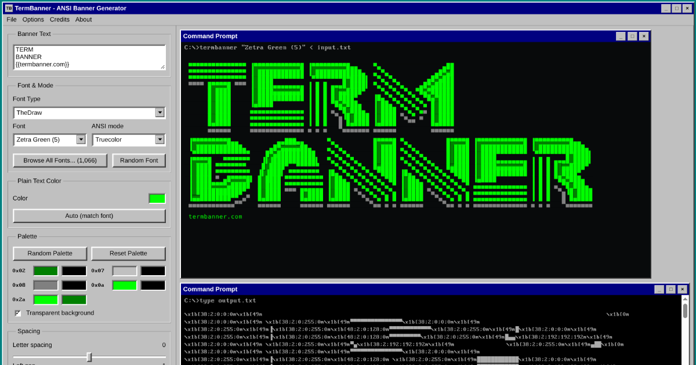

# TermBanner



Live at [termbanner.com](https://termbanner.com)

Static web app for building colored ANSI ASCII banners and exporting them as ready-to-run startup scripts. Supports solid colors, multi-stop gradients, FIGlet (.flf) fonts, and TheDraw color (.tdf) fonts, with export to Bash/shell, PowerShell, Python, Go, Rust, and JavaScript scripts, plain ANSI/text, or a combined ZIP archive.

## Development

Install local dependencies:

```sh
npm install
```

Run the development server:

```sh
npm run dev
```

Build the static site:

```sh
npm run build
```

The build output is written to `dist/`.

Pushes to `main` automatically build and deploy via Cloudflare Pages (build command `npm run build`, output directory `dist`). The dynamic HTTP API runs as Cloudflare Pages Functions under [`functions/api/`](functions/api/). To run the site and API together locally against a build:

```sh
npm run build
npx wrangler pages dev dist
```

## Fonts

### Built-in fonts

A built-in block-character font (ANSI Regular) is bundled directly in the app and requires no build step.

### FIGlet fonts (.flf)

Source `.flf` files live under `fonts/flf/`. The build script converts them to JSON assets consumed by the browser. Around 580 FIGlet fonts are included.

### TheDraw TDF color fonts (.tdf)

Source `.tdf` files live under `fonts/tdf/`. The build script converts them to JSON assets at build time. Around 1,066 TheDraw color fonts are included. The browser does not run any native binary, and the rendered site is fully static. The optional HTTP API runs as a Cloudflare Pages Function (see below); the static site itself needs no backend. The app opens on a random TheDraw font by default; switch the Font Type filter to Figlet or All to browse the rest.

### Building font assets

Convert all source fonts to browser-ready JSON:

```sh
npm run fonts
```

`npm run build` runs the font conversion automatically before building the static site.

The converter writes:

- `public/fonts/ansi-fonts.json` (built-in fonts)
- `public/fonts/tdf/index.json` and one JSON file per TDF font
- `public/fonts/flf/index.json` and one JSON file per FIGlet font

## HTTP API

TermBanner exposes a public read-only HTTP API so banners can be generated by URL. The same URL returns raw ANSI for terminals and a colored HTML page for browsers (content negotiation on the `Accept` header). Output is identical to the web app. Full reference: [`docs/api.md`](docs/api.md).

```sh
# colored ANSI, pipe straight to a terminal
curl 'https://termbanner.com/api?text=HELLO&font=ANSI%20Shadow&gradient=33ff00,0066ff'

# uncolored ASCII
curl 'https://termbanner.com/api?text=HI&font=Standard&mode=plain'

# TheDraw font with its built-in colors
curl 'https://termbanner.com/api?text=HI&font=1911'

# list available font names
curl 'https://termbanner.com/api/fonts'
```

| Param | Default | Notes |
| --- | --- | --- |
| `text` | (required) | `\n` for multi-line. Max 200 chars. |
| `font` | `ANSI Shadow` | name or key; `flf:`/`tdf:` prefix forces an exact match |
| `mode` | `ansi` | `ansi` (color) or `plain` (no color) |
| `color` | - | solid hex (FIGlet/ANSI fonts) |
| `gradient` | `33ff00,0066ff` | comma hex list (FIGlet/ANSI fonts), max 10 stops |
| `depth` | `truecolor` | `truecolor`, `256`, or `16` |
| `letterspacing` | `0` | range [-50, 50] |
| `linespacing` | `1` | range [-50, 50] |
| `padleft` / `padtop` / `padbottom` | `1` | range [-50, 100] |
| `palette` | - | TheDraw per-slot override, e.g. `01-ff0000-000000` |
| `plaincolor` | - | solid hex for `{{ }}` plain-text lines (default: auto-matches the font) |
| `format` | - | Return a ready-to-run script: `bash`, `powershell`, `python`, `go`, `rust`, `javascript` |

Add literal (non-font) text with `{{ }}` blocks in the banner text, on their own lines, above, below, or between the art. Blocks can span multiple lines and preserve blank lines and spacing. In the web app a "Plain Text Color" picker appears when plain text is present; its default auto-matches the font: the solid color for FIGlet/ANSI, the dominant color for TheDraw.

```sh
# generate a self-contained startup-banner script
curl -s 'https://termbanner.com/api?text=DEPLOY&font=Standard&color=ff8800&format=bash' | sh
```

The web app shows a copyable `curl` command that reproduces the current banner, so any design built in the UI can be reproduced from the command line.

## Verification

```sh
npm test
npm run build
```

## License

MIT. See [LICENSE](LICENSE).

## Credits

### FIGlet fonts (.flf)

The FIGlet font collection is the work of many contributors. The FIGlet program and the majority of bundled fonts were created by Glenn Chappell and Ian Chai, with additional fonts contributed by the wider community over many years.

- Project: [figlet.org](http://www.figlet.org/)
- Selected font authors include: Glenn Chappell, Ian Chai, Frans P. de Vries, and many others credited in individual font file headers.

### TheDraw TDF fonts (.tdf)

The TheDraw font format originates from TheDraw (The Drawing Tool), a DOS ANSI art editor created by Ian E. Davis (circa 1988-1993). The bundled `.tdf` fonts were created by artists from the BBS and ANSI art scene and distributed as freeware.

- TheDraw created by: Ian E. Davis

### Perfect DOS VGA 437

The terminal preview uses the Perfect DOS VGA 437 typeface by Zeh Fernando, which faithfully recreates the IBM PC VGA BIOS character set for use on modern displays. Distributed as freeware.
